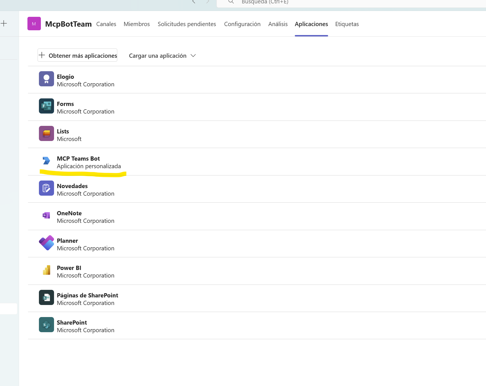
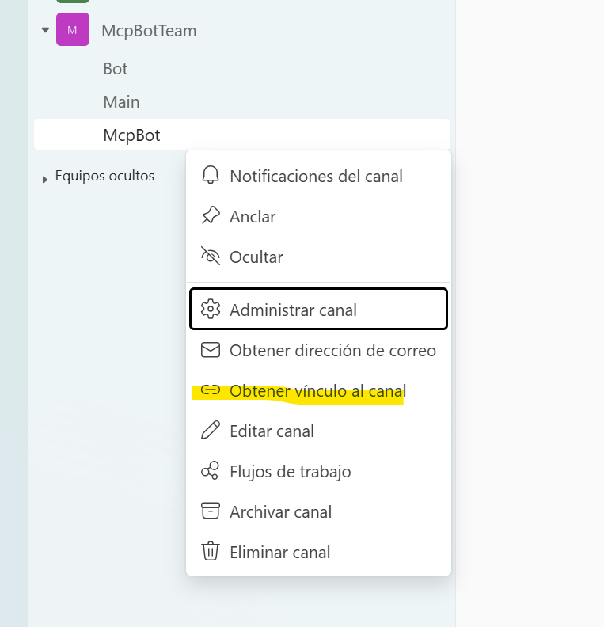

# MCP Teams Server

An MCP (Model Context Protocol) server implementation for Microsoft Teams integration, providing capabilities to 
read messages, create messages, reply to messages, mention members.

## Features

- Start thread in channel with title and contents
- Update existing threads with message replies
- Mention users in threads
- Read thread replies
- List channel team members
- Read channel messages

## Prerequisites

- uv package manager
- Python 3.10
- Microsoft Teams account with appropriate permissions

## Installation

1. Clone the repository:

```bash
git clone [repository-url]
cd mcp-teams-server
```

2. Create a virtual environment and install dependencies:

```bash
uv venv
uv sync
```

## Teams configuration

### Application registration

You must [follow the instructions](https://learn.microsoft.com/en-us/entra/identity-platform/quickstart-register-app?tabs=certificate%2Cexpose-a-web-api) for creating and registering an application in Microsoft Entra ID.

Microsoft Bot Framework will use [REST Authentication](https://learn.microsoft.com/en-us/azure/bot-service/rest-api/bot-framework-rest-connector-authentication?view=azure-bot-service-4.0&tabs=singletenant#step-1-request-an-access-token-from-the-microsoft-entra-id-account-login-service)

During development of this MCP Server we used SingleTenant authentication for our demo application with client credentials.


You will need to request MS Graph API permissions to grant channel message read. These permissions are scoped to the team were the app is installed.


### Azure Bot registration

Follow the instructions provided by Microsoft
regarding [this topic](https://learn.microsoft.com/en-us/azure/bot-service/bot-service-quickstart-registration?view=azure-bot-service-4.0&tabs=userassigned)

Bot will use Microsoft Entra ID application registration information.


Bot will be allowed to interact with Teams Channel:


### Microsoft application publishing

Create an application for Microsoft Teams
using [Teams Developer Portal](https://learn.microsoft.com/en-us/microsoftteams/platform/concepts/build-and-test/teams-developer-portal).

You will need bot information from previous [Azure Bot Registration](#azure-bot-registration).

A sample application skeleton with required permissions and configuration is provided as [a model](./app/manifest.json)


This application needs to be installed in a Teams Group



And some information must be extracted from the Teams Group url:



- groupId parameter holds the value to configure TEAM_ID environment variable
- TEAMS_CHANNEL_ID path parameter holds the value to configure the environment variable with the same name

```
https://teams.microsoft.com/l/channel/[TEAMS_CHANNEL_ID]/McpBot?groupId=[TEAM_ID]&tenantId=[TEAMS_APP_TENANT_ID]
```

## Usage

Set up the following environment variables in your shell or in an .env file:

- TEAMS_APP_ID=<uuid for your MS Entra ID application ID>
- TEAMS_APP_PASSWORD=<client secret>
- TEAMS_APP_TYPE=<SingleTenant or MultiTenant>
- TEAMS_APP_TENANT_ID=<Tenant uuid in case of SingleTenant>
- TEAM_ID=<MS Teams Group Id or Team Id>
- TEAMS_CHANNEL_ID=<MS Teams Channel ID with url escaped chars>

Start server:

```bash
uv run mcp-teams-server
```

## Development

Integration tests require the set up the following environment variables:

- TEST_THREAD_ID=<timestamp of the thread id>
- TEST_MESSAGE_ID=<timestamp of the message id>
- TEST_USER_NAME=<test user name>

```bash
uv run pytest
```

### Build docker image

A docker image is available to run MCP server:

```bash
docker build . -t inditextech/mcp-teams-server
```

### Run interactively docker image

```bash
docker run -it inditextech/mcp-teams-server
```

### Setup Claude desktop to use docker image

```yaml
{
  "mcpServers": {
    "teams": {
      "command": "docker",
      "args": [
        "run",
        "-i"
        "--rm"
        "-e",
        "TEAMS_APP_ID",
        "-e",
        "TEAMS_APP_PASSWORD",
        "-e",
        "TEAMS_APP_TYPE",
        "-e",
        "TEAMS_APP_TENANT_ID",
        "-e",
        "TEAM_ID",
        "-e",
        "TEAMS_CHANNEL_ID",
        "inditextech/mcp-teams-server"
      ],
      "env": {
        "TEAMS_APP_ID": "<fill_me_with_proper_uuid>",
        "TEAMS_APP_PASSWORD": "<fill_me_with_proper_uuid>",
        "TEAMS_APP_TYPE": "<fill_me_with_proper_uuid>",
        "TEAMS_APP_TENANT_ID": "<fill_me_with_proper_uuid>",
        "TEAM_ID": "<fill_me_with_proper_uuid>",
        "TEAMS_CHANNEL_ID": "<fill_me_with_proper_channel_id>",
        "DOCKER_HOST": "unix:///var/run/docker.sock"
      }
    }
  }
}
```

### Setup Cline to use docker image

```yaml 
{
  "mcpServers": {
    "github.com/inditextech/mcp-teams-server/tree/main": {
      "command": "wsl",
      "args": [
        "TEAMS_APP_ID=<fill_me_with_proper_uuid>",
        "TEAMS_APP_PASSWORD=<fill_me_with_proper_uuid>",
        "TEAMS_APP_TYPE=<fill_me_with_proper_uuid>",
        "TEAMS_APP_TENANT_ID=<fill_me_with_proper_uuid>",
        "TEAM_ID=<fill_me_with_proper_uuid>",
        "TEAMS_CHANNEL_ID=<fill_me_with_proper_uuid>",
        "docker",
        "run",
        "-i",
        "--rm",
        "inditextech/mcp-teams-server"
      ],
      "env": {
        "DOCKER_HOST": "unix:///var/run/docker.sock"
      },
      "disabled": false,
      "autoApprove": [ ],
      "timeout": 300
    }
  }
}
```

## Contributing

Please read [CONTRIBUTING.md](CONTRIBUTING.md) for details on our code of conduct and the process for submitting pull
requests.

## Security

For security concerns, please see our [Security Policy](SECURITY.md).

## License

This project is licensed under the Apache License 2.0 - see the [LICENSE](LICENSE) file for details.

## Changelog

See [CHANGELOG.md](CHANGELOG.md) for a list of changes and version history.


