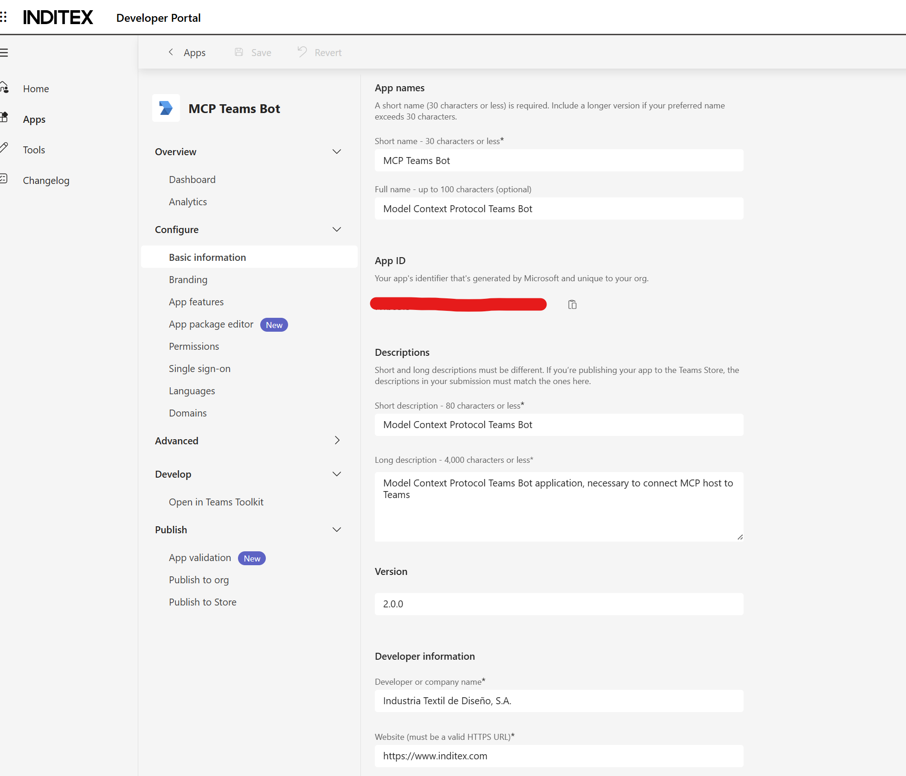
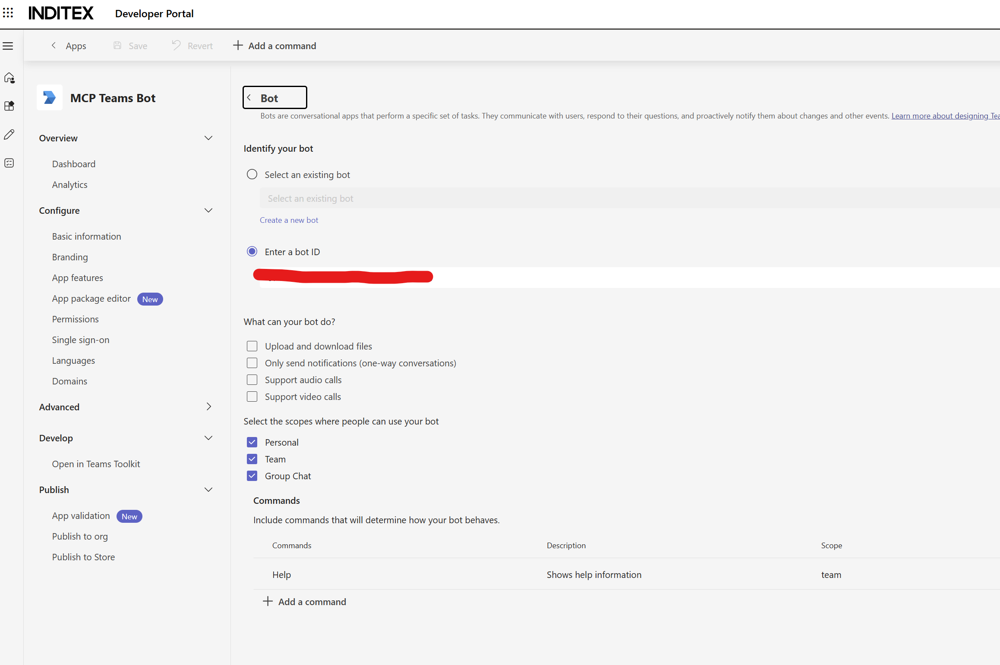
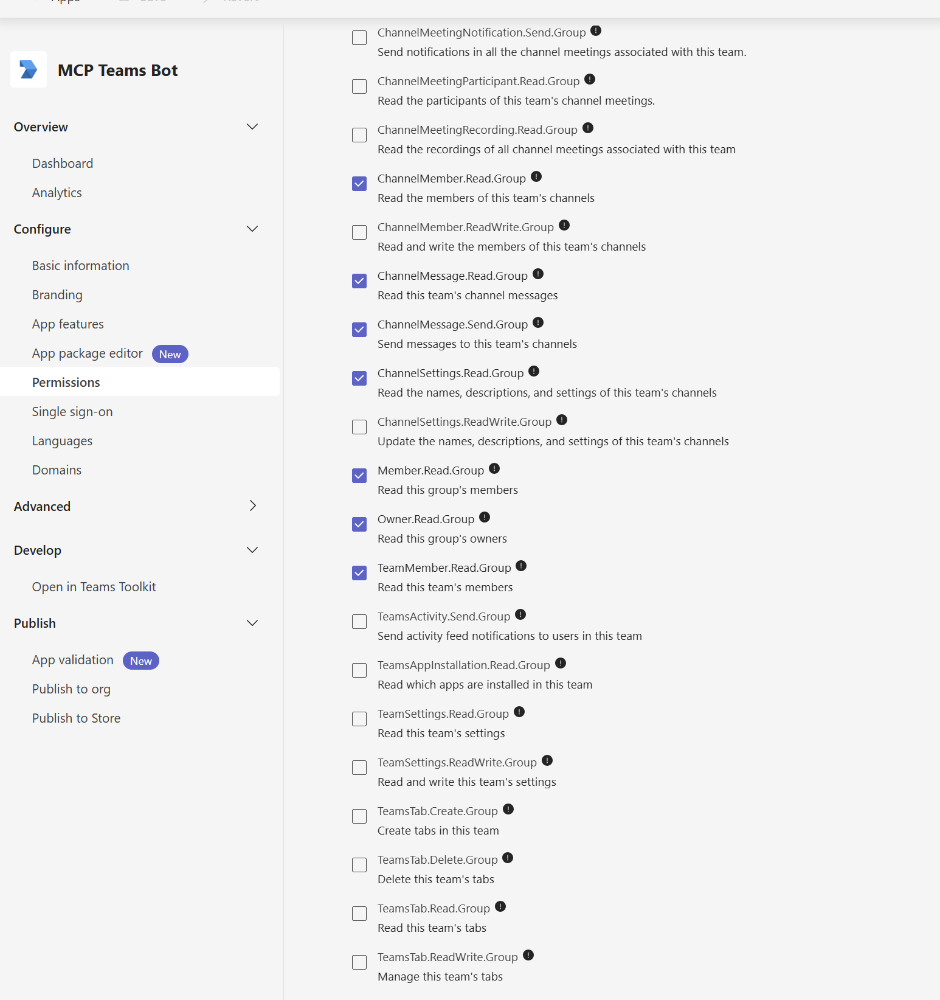

## Teams configuration

### Application registration

You must [follow the instructions](https://learn.microsoft.com/en-us/entra/identity-platform/quickstart-register-app?tabs=certificate%2Cexpose-a-web-api) 
for creating and registering an application in Microsoft Entra ID.

Microsoft Bot Framework will use [REST Authentication](https://learn.microsoft.com/en-us/azure/bot-service/rest-api/bot-framework-rest-connector-authentication?view=azure-bot-service-4.0&tabs=singletenant#step-1-request-an-access-token-from-the-microsoft-entra-id-account-login-service)

During development of this MCP Server we used SingleTenant authentication for our demo application with client credentials.


You will need to request MS Graph API permissions to grant channel message read. These permissions are scoped to the team were the app is installed.


### Azure Bot registration

Follow the instructions provided by Microsoft
regarding [this topic](https://learn.microsoft.com/en-us/azure/bot-service/bot-service-quickstart-registration?view=azure-bot-service-4.0&tabs=userassigned)

Bot will use Microsoft Entra ID application registration information.


Bot will be allowed to interact with Teams Channel:


You will not need to deploy a Bot application because this MCP server uses Azure Bot Framework as a client to Bot Framework api.

### Microsoft application publishing

Create an application for Microsoft Teams
using [Teams Developer Portal](https://learn.microsoft.com/en-us/microsoftteams/platform/concepts/build-and-test/teams-developer-portal).

You will need bot information from previous [Azure Bot Registration](#azure-bot-registration).

A sample application skeleton with required permissions and configuration is provided as [a model](./app/manifest.json)







This application needs to be installed in a Teams Group


And some information must be extracted from the Teams Group url:


- groupId parameter holds the value to configure TEAM_ID environment variable
- TEAMS_CHANNEL_ID path parameter holds the value to configure the environment variable with the same name

```
https://teams.microsoft.com/l/channel/[TEAMS_CHANNEL_ID]/McpBot?groupId=[TEAM_ID]&tenantId=[TEAMS_APP_TENANT_ID]
```